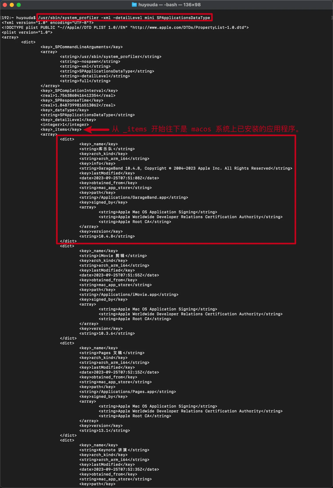

# [0005. 获取 macos 下都安装了哪些应用](https://github.com/tnotesjs/TNotes.nodejs/tree/main/notes/0005.%20%E8%8E%B7%E5%8F%96%20macos%20%E4%B8%8B%E9%83%BD%E5%AE%89%E8%A3%85%E4%BA%86%E5%93%AA%E4%BA%9B%E5%BA%94%E7%94%A8)


<!-- region:toc -->

- [1. 🔗 links](#1--links)
- [2. 📒 macOS 中的 system_profiler 是什么？](#2--macos-中的-system_profiler-是什么)
- [3. 📒 plist.js 是什么？有什么用？](#3--plistjs-是什么有什么用)
- [4. 💻 demo](#4--demo)

<!-- endregion:toc -->
- 本文介绍了类似 rubick 这样的效率工具，是如何实现本地应用快速检索并启动的。

## 1. 🔗 links

- https://github.com/rubickCenter/rubick - github - rubick。
- https://rubick.vip/ - rubick 官网。
- https://www.npmjs.com/package/plist - npm - plist。

## 2. 📒 macOS 中的 system_profiler 是什么？

要在 macOS 下获取安装的应用，其实可以直接使用系统配置概要工具（system_profiler）来实现。**system_profiler 是 macOS 系统中的命令行工具，用于获取系统的各种硬件和软件配置信息。**它能够提供关于电脑硬件、网络、软件以及许多其他系统组件的详尽信息。

一些常用的参数如下：
- `-xml`：以 XML 格式输出信息。
- `-detailLevel`：控制信息的详细程度，可设置为 `basic`、`mini` 或 `full`。
- `-listDataTypes`：列出可用的数据类型。
- `-help`：显示帮助信息，列出可用参数和选项。
- `-timeout`：设置超时时间，限制信息的收集时间。
- `-nospin`：在收集信息时禁用硬盘旋转。

比如，获取系统中安装了哪些应用，就可以直接使用命令行：

```bash
$ /usr/sbin/system_profiler -xml -detailLevel mini SPApplicationsDataType
```

- `-xml` 表示输出以 XML 格式呈现。
- `-detailLevel mini` 表示只显示最小级别的详细信息。
- `SPApplicationsDataType` 参数的语义是指示 `system_profiler` 工具收集和显示关于 macOS 系统上已安装应用程序的数据。



注意，最终输出的格式是一个 XML 的内容，其中数组第一项如下。

```xml
<dict>
  <key>_name</key>
  <string>库乐队</string>
  <key>arch_kind</key>
  <string>arch_arm_i64</string>
  <key>info</key>
  <string>GarageBand 10.4.8, Copyright © 2004–2023 Apple Inc. All Rights Reserved</string>
  <key>lastModified</key>
  <date>2023-09-25T07:51:08Z</date>
  <key>obtained_from</key>
  <string>mac_app_store</string>
  <key>path</key>
  <string>/Applications/GarageBand.app</string>
  <key>signed_by</key>
  <array>
    <string>Apple Mac OS Application Signing</string>
    <string>Apple Worldwide Developer Relations Certification Authority</string>
    <string>Apple Root CA</string>
  </array>
  <key>version</key>
  <string>10.4.8</string>
</dict>
```

## 3. 📒 plist.js 是什么？有什么用？

Plist.js 是一个用于解析和构建 Plist（属性列表）文件的工具，适用于 Node.js 和浏览器环境。Plist 文件常用于 macOS 和 iOS 应用程序的编程中，以及 iTunes 配置 XML 文件。

Plist.js 的主要功能包括：
1. **读取 Plist 文件**：将 Plist 文件内容解析为 JavaScript 对象。
2. **写入 Plist 文件**：将 JavaScript 对象转换为 Plist 文件格式。

Plist 文件类似于 JSON 文件，它们都用于表示存储的编程对象。通过 Plist.js，开发者可以方便地在 JavaScript 环境中操作 Plist 文件。

**Plist 文件**：Plist 文件（Property List 文件）是一种用于存储序列化数据的文件格式，常用于 macOS 和 iOS 应用程序中。Plist 文件可以用来保存应用程序的配置数据、用户设置、序列化对象等。

Plist 文件有两种常见的格式：
1. **XML 格式**：这种格式是人类可读的，并且可以使用文本编辑器查看和编辑。XML 格式的 Plist 文件以 `<plist>` 标签开头和结尾，并包含键值对的层次结构。
2. **二进制格式**：这种格式是更紧凑的二进制编码，通常用于提高读取和写入速度，但不易被人类直接读取。

**无论是 XML 还是二进制格式，Plist 文件都能表示多种数据类型，包括：**
- 字符串
- 数字（整数和浮点数）
- 布尔值
- 日期
- 数据（字节数组）
- 数组
- 字典（键值对集合）

Plist 文件的一个典型应用示例是存储应用程序的配置信息，如用户偏好设置、应用程序的状态数据等。通过使用 Plist.js 这样的工具，开发者可以在 JavaScript 环境中方便地读取和写入这些文件。

system_profiler 打印的内容如下。

```bash
$ /usr/sbin/system_profiler -xml -detailLevel mini SPApplicationsDataType
# <?xml version="1.0" encoding="UTF-8"?>
# <!DOCTYPE plist PUBLIC "-//Apple//DTD PLIST 1.0//EN" "http://www.apple.com/DTDs/PropertyList-1.0.dtd">
# <plist version="1.0">
# <array>
# 	<dict>
# 		<key>_SPCommandLineArguments</key>
# 		<array>
# 			<string>/usr/sbin/system_profiler</string>
# 			<string>-nospawn</string>
# 			<string>-xml</string>
# 			<string>SPApplicationsDataType</string>
# 			<string>-detailLevel</string>
# 			<string>full</string>
# 		</array>
# …… more info ……
```

**system_profiler 打印的内容其实就是可以拿 plist.js 来解析的。**

## 4. 💻 demo

**流程分析**

通过 nodejs 来获取到 macos 上已安装的所有应用，简单来讲可以分为以下几步：
1. 使用 node shell 脚本调用 system_profiler 命令。
2. 获取到 XML 数据后，通过 plist 解析 XML。
3. 返回解析后的数据。

**源码实现**

```js
// index.js
const { spawn } = require('child_process')
const plist = require('plist') // https://www.npmjs.com/package/plist

function getApps(resolve, reject) {
  let resultBuffer = Buffer.from([])
  // 通过 spawn 调用 system_profiler 脚本
  const profileInstalledApps = spawn('/usr/sbin/system_profiler', [
    '-xml',
    '-detailLevel',
    'mini',
    'SPApplicationsDataType',
  ])

  // 监听返回结果，写入 resultBuffer
  profileInstalledApps.stdout.on('data', (chunkBuffer) => {
    resultBuffer = Buffer.concat([resultBuffer, chunkBuffer])
  })

  // 监听退出事件
  profileInstalledApps.on('exit', (exitCode) => {
    if (exitCode !== 0) {
      reject('Failed to get the list of installed applications.')
      return
    }

    try {
      // 解析 XML 文档
      const [installedApps] = plist.parse(resultBuffer.toString())
      // 返回结果
      resolve(installedApps._items)
    } catch (error) {
      reject(error)
    }
  })

  // 出错后抛出
  profileInstalledApps.on('error', (err) => {
    reject(err)
  })
}

getApps(
  (apps) => {
    console.log('Installed Applications:', apps)
    console.log('Count:', apps.length)
  },
  (error) => {
    console.error('Error:', error)
  }
)
```

最终输出结果很多，测试时统计出来共有 371 个应用。


下面是对一些字段的解释说明。
- **_name 应用程序的名称。**
- arch_kind 应用程序的架构类型。比如 arch_arm_i64，意味着它们是为基于 ARM 架构的 64 位处理器编译的，这通常指的是 Apple 自家的 M1 或 M2 这类芯片。
- lastModified 应用程序最后一次修改的日期和时间。
- obtained_from 应用程序的来源。比如 apple，表示这些应用程序都是由苹果公司官方提供。mac_app_store，表示这是从 mac 的应用商店提供的应用。unknown，表示来源未知。
- **path 应用程序在系统上的安装路径。**
- signed_by 一个包含签名证书链的数组，用于验证应用程序的完整性和来源。这里的证书链包括 Software Signing、Apple Code Signing Certification Authority 和 Apple Root CA，这表示这些应用程序都是由苹果公司签名的，确保了其安全性和可信度。
- version 应用程序的版本号。
- info 特定应用程序的额外信息，可能包括版权信息、版本详情等。这个字段不是每个应用程序都有的，只在提供了额外信息的情况下出现。

其中比较重要的主要是 _name 和 path，有了这俩玩意儿，再结合上 Electron 这类的客户端技术，你就可以将程序名称展示给用户，让用户选择需要打开的应用程序。rubick 的应用程序快速检索功能的实现，就是这么干的。这就好比 macOS 自带的 cmd + space 唤起 Spotlight 输入程序名称即可快速打开程序的效果一样。只需要简单修改一下调用示例，我们就能轻松获取到当前用户的 macos 上安装的所有应用名称。

```js
getApps(
  (apps) => {
    console.log(apps.map(({_name}, i) => `${i + 1}. ${_name}`).join('\n'));
  },
  (error) => {
    console.error("Error:", error);
  }
);
```

**获取所有应用程序名称列表**

```bash
$ node index.js
# 1. 库乐队
# 2. iMovie 剪辑
# 3. Pages 文稿
# 4. Keynote 讲演
# 5. Numbers 表格
# 6. group.is.workflow
# 7. 4WV38P2X5K.net.xmind
# 8. Electron
# 9. Paste
# 10. Sourcetree
# 11. DisplayLink Manager
# 12. Google Chrome
# 13. Navicat Premium
# 14. Postman
# 15. WPS Office
# 16. Tencent Lemon
# 17. ScreenBrush
# 18. 1Password 7
# 19. EVPlayer2
# 20. 剪映专业版
# 21. IDLE
# 22. Python Launcher
# 23. GIF Brewery 3
# 24. Downie 4
# 25. 网易有道翻译
# 26. Electron
# 27. com.apple.ctcategories
# 28. Electron
# 29. 语雀
# 30. BackService
# 31. SIMBLAgent
# 32. Python
# 33. ClashX Pro
# 34. Logitech G HUB
# 35. Electron
# 36. Electron
# 37. Omi录屏专家
# 38. 谜底时钟
# 39. Python
# 40. FastZip
# 41. Rectangle
# 42. Mos
# 43. Xmind
# 44. My Screen Brush
# 45. SogouInput
# 46. sogou_mac_614d
# 47. 百度网盘
# 48. 即刻转换
# 49. OmniPlayer
# 50. 微信
# 51. WGestures
# 52. AirScanLegacyDiscovery
# 53. Recursive File Processing Droplet
# 54. Droplet with Settable Properties
# 55. Recursive Image File Processing Droplet
# 56. Cocoa-AppleScript Applet
# 57. AppleMobileDeviceHelper
# 58. MobileDeviceUpdater
# 59. AppleMobileSync
# 60. MRT
# 61. RustDesk
# 62. KeyCastr
# 63. GoogleUpdater
# 64. Snipaste
# 65. Visual Studio Code
# 66. Tickeys
# 67. WeType
# 68. 滴答清单
# 69. QQ音乐
# ...
```
