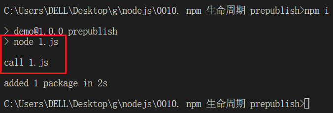

# [0010. npm 生命周期 prepublish](https://github.com/tnotesjs/TNotes.nodejs/tree/main/notes/0010.%20npm%20%E7%94%9F%E5%91%BD%E5%91%A8%E6%9C%9F%20prepublish)

<!-- region:toc -->

- [1. 💻 demos.1 - npm 生命周期 prepublish 的基本使用](#1--demos1---npm-生命周期-prepublish-的基本使用)
- [2. 🤖 请介绍一下 package.json 中的 scripts 字段下的 prepublish](#2--请介绍一下-packagejson-中的-scripts-字段下的-prepublish)
  - [2.1. 使用 `prepublishOnly`](#21-使用-prepublishonly)
  - [2.2. 注意事项](#22-注意事项)

<!-- endregion:toc -->

## 1. 💻 demos.1 - npm 生命周期 prepublish 的基本使用

新建一个 [1.js](./1.js) 模块，内容如下：

```js
console.log('call 1.js')
```

新建一个 [package.json](./package.json) 模块，内容如下：

```json
{
  "name": "demo",
  "version": "1.0.0",
  "scripts": {
    "prepublish": "node 1.js"
  },
  "dependencies": {
    "lodash": "^4.17.21"
  }
}
```

执行 `npm i` 安装依赖。（如果存在 node_modules，将其删除后再执行 npm i）会发现 prepublish 中配置的命令 `node 1.js` 自动执行了，`1.js` 执行后输出了 `call 1.js`。 

## 2. 🤖 请介绍一下 package.json 中的 scripts 字段下的 prepublish

在 `package.json` 文件中，`scripts` 字段允许你定义可以在命令行中通过 `npm run <script-name>` 执行的脚本。这些脚本可以是任何 shell 命令，通常用于自动化构建、测试、部署等任务。

`prepublish` 是一个特殊的 npm 生命周期脚本，它在你运行 `npm publish` 之前自动执行。这个脚本可以用来执行一些发布前的准备工作，比如编译代码、运行测试、更新版本号等。不过需要注意的是，`prepublish` 脚本的行为在 npm 的不同版本中有过变化：

- **npm 5.0.0 及之后**：`prepublish` 脚本会被当作 `prepare` 脚本来处理。也就是说，当你安装一个包（无论是本地开发还是作为依赖）时，`prepublish` 也会被运行。如果你只想在发布前运行某些脚本，应该使用 `prepublishOnly`。
- **npm 4.0.0 及之前**：`prepublish` 在 `npm publish` 之前运行，并且不会在安装时运行。

### 2.1. 使用 `prepublishOnly`

为了确保你的准备脚本只在发布前运行，你应该使用 `prepublishOnly` 而不是 `prepublish`。下面是一个示例 `package.json` 中的 `scripts` 字段配置：

```json
{
  "name": "your-package",
  "version": "1.0.0",
  "scripts": {
    "build": "webpack --config webpack.config.js",
    "test": "jest",
    "prepublishOnly": "npm run build && npm run test"
  }
}
```

在这个例子中：

- `build` 脚本用于编译源代码。
- `test` 脚本用于运行测试。
- `prepublishOnly` 脚本会在 `npm publish` 之前执行，它首先调用 `build` 脚本来编译代码，然后调用 `test` 脚本来确保一切正常。

### 2.2. 注意事项

- 如果你在 `prepublishOnly` 中有耗时较长的操作（如编译大型项目），请确保这是必要的，因为这将影响发布流程的时间。
- 确保 `prepublishOnly` 脚本能够正确地处理错误并给出明确的反馈，这样在发布过程中如果出现问题，你可以快速定位和修复。
- 如果你希望在安装时也执行某些准备步骤（例如编译 TypeScript 代码到 JavaScript），那么可以使用 `prepare` 脚本。

通过这种方式，你可以确保每次发布时都有一致的构建过程，从而提高发布的可靠性和代码的质量。
