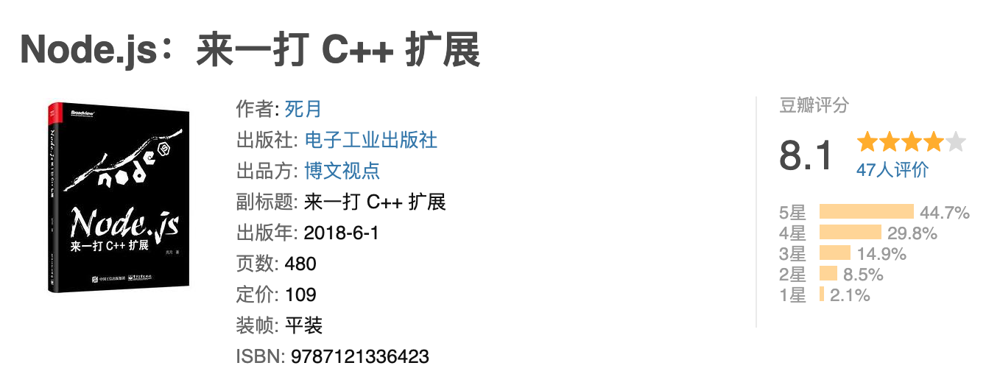

# [0016. 《Node.js来一打C++扩展》](https://github.com/Tdahuyou/TNotes.nodejs/tree/main/notes/0016.%20%E3%80%8ANode.js%E6%9D%A5%E4%B8%80%E6%89%93C%2B%2B%E6%89%A9%E5%B1%95%E3%80%8B)

<!-- region:toc -->

- [1. 🔗 豆瓣](#1--豆瓣)
- [2. 📒 《Node.js来一打C++扩展》 简介](#2--nodejs来一打c扩展-简介)

<!-- endregion:toc -->

## 1. 🔗 豆瓣

- https://book.douban.com/subject/30247892/
  - 豆瓣 - 《Node.js来一打C++扩展》

## 2. 📒 《Node.js来一打C++扩展》 简介

- 豆瓣评分（24.10.21）：
  - 
- 内容简介
  - Node.js 作为近几年新兴的一种编程运行时，托 V8 引擎的福，在作为后端服务时有比较高的运行效率，在很多场景下对于我们的日常开发足够用了。不过，它还为开发者开了一个使用C++ 开发 Node.js 原生扩展的口子，让开发者进行项目开发时有了更多的选择。
  - 《Node.js：来一打 C++ 扩展》以 Chrome V8 的知识作为基础，配合 GYP 的一些内容，将教会大家如何使用 Node.js提供的一些 API 来编写其 C++ 的原生扩展。此外，在后续的进阶章节中，还会介绍原生抽象NAN 以及与异步相关的 libuv 知识，最后辅以几个实例来加深理解。不过，在学习本书内容之前，希望读者已经具备了初步的 Node.js 以及 C++ 基础。
  - 阅读《Node.js：来一打 C++ 扩展》，相当于同时学习Chrome V8 开发、libuv 开发以及 Node.js 的原生 C++ 扩展开发知识，非常值得！
