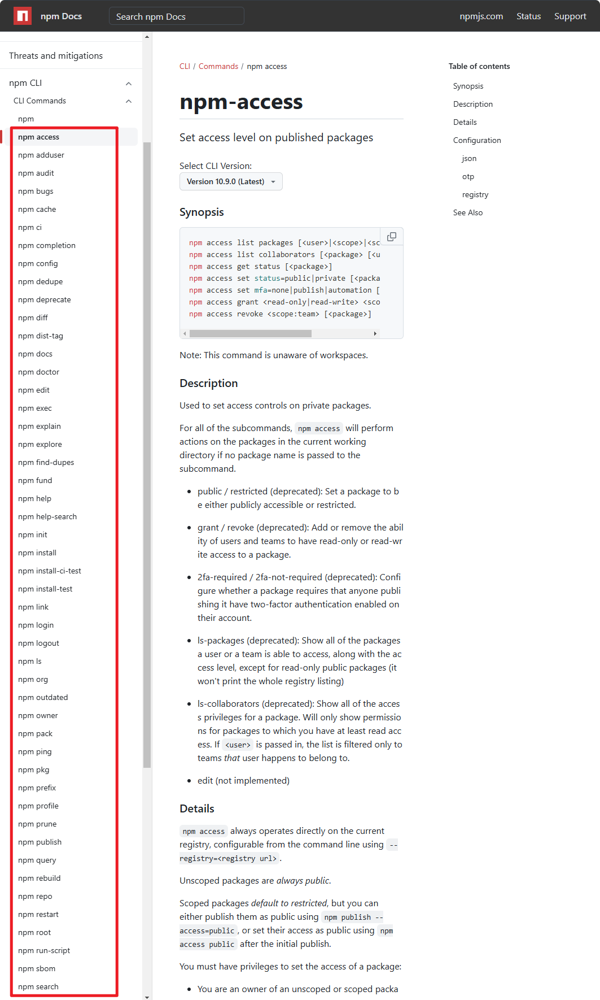

# [0023. npm 内置命令](https://github.com/Tdahuyou/TNotes.nodejs/tree/main/notes/0023.%20npm%20%E5%86%85%E7%BD%AE%E5%91%BD%E4%BB%A4)

<!-- region:toc -->
- [1. 🔗 查看 npm 内置命令](#1--查看-npm-内置命令)
- [2. 🤔 思考：为什么 npm start 不需要 run，npm run start？](#2--思考为什么-npm-start-不需要-runnpm-run-start)
- [3. 📒 npm 内置命令 vs. 非 npm 内置命令](#3--npm-内置命令-vs-非-npm-内置命令)
- [4. 📒 内置命令列表](#4--内置命令列表)
- [5. 📒 常见内置命令分类](#5--常见内置命令分类)
<!-- endregion:toc -->
- 知道什么是 npm 内置命令。
- 对目前（2024年11月6日18:52:37）能查询到的所有内置命令做了一个简单的描述、分类。

## 1. 🔗 查看 npm 内置命令

- https://docs.npmjs.com/cli/v10/commands/npm
  - 查看 npm 内置命令

## 2. 🤔 思考：为什么 npm start 不需要 run，npm run start？

- **因为 `start` 是内置命令**
- 在 npm 中，`npm start` 不需要 `run` 的原因是 `start` 是 npm 默认的脚本别名之一。npm 具有一些内置的脚本别名，如果你定义了这些脚本名称，可以直接用 `npm <command>` 形式运行，而不需要 `npm run <command>`。这主要是为了简化常见命令的执行方式。

## 3. 📒 npm 内置命令 vs. 非 npm 内置命令

- 除了 start 之外，还有哪些命令是不需要加 run 就可以直接运行的？可以在官方的 npm cli 中查询。比如：
  - `npm start` 通常用来启动应用或服务器。
  - `npm test` 一般用于运行测试脚本。
  - `npm restart` 用于重启应用，通常可以结合 `stop` 和 `start`。
  - `npm stop` 用于停止应用。
  - 
- 对于非 npm 内置命令，如 `build`、`lint` 或其它自定义的命令，都需要通过 `npm run <command>` 来执行，例如：
  - `npm run dev`
  - `npm run build`
  - `npm run lint`

## 4. 📒 内置命令列表

| 命令                  | 简述                                                |
| --------------------- | --------------------------------------------------- |
| `npm access`          | 管理包的访问权限。                                  |
| `npm adduser`         | 在 npm 注册或登录。                                 |
| `npm audit`           | 检查并修复依赖中的安全问题。                        |
| `npm bugs`            | 打开包的错误跟踪页面。                              |
| `npm cache`           | 查看或管理 npm 的缓存。                             |
| `npm ci`              | 根据 `package-lock.json` 安装依赖，适用于 CI 环境。 |
| `npm completion`      | 启用 shell 自动补全功能。                           |
| `npm config`          | 配置 npm 的设置参数。                               |
| `npm dedupe`          | 优化依赖，消除重复包。                              |
| `npm deprecate`       | 将某个包或版本标记为废弃。                          |
| `npm diff`            | 查看当前目录下文件与已发布版本的差异。              |
| `npm dist-tag`        | 管理包的发布标签（如 `latest`）。                   |
| `npm docs`            | 打开包的文档页面。                                  |
| `npm doctor`          | 检查 npm 环境是否有潜在问题。                       |
| `npm edit`            | 编辑已安装的包。                                    |
| `npm exec`            | 在 PATH 中执行命令。                                |
| `npm explain`         | 解释依赖树中某个依赖的来源。                        |
| `npm explore`         | 打开本地安装包的 shell。                            |
| `npm find-dupes`      | 查找重复的依赖包。                                  |
| `npm fund`            | 查看项目或依赖的资金支持信息。                      |
| `npm help`            | 查看 npm 命令的帮助信息。                           |
| `npm help-search`     | 搜索帮助文档。                                      |
| `npm init`            | 初始化一个新的 `package.json` 文件。                |
| `npm install`         | 安装项目依赖或特定包。                              |
| `npm install-ci-test` | 在 CI 环境中测试安装。                              |
| `npm install-test`    | 安装依赖并运行测试。                                |
| `npm link`            | 创建符号链接，便于本地开发。                        |
| `npm login`           | 登录到 npm。                                        |
| `npm logout`          | 登出 npm。                                          |
| `npm ls`              | 列出已安装的包及依赖树。                            |
| `npm org`             | 管理 npm 组织。                                     |
| `npm outdated`        | 显示过时的依赖包。                                  |
| `npm owner`           | 管理包的所有者。                                    |
| `npm pack`            | 创建包的 tarball 文件。                             |
| `npm ping`            | 测试与 npm 的连接。                                 |
| `npm pkg`             | 管理 `package.json` 中的字段。                      |
| `npm prefix`          | 显示当前目录的 npm 路径前缀。                       |
| `npm profile`         | 管理 npm 用户信息。                                 |
| `npm prune`           | 删除无关或多余的包。                                |
| `npm publish`         | 发布包到 npm。                                      |
| `npm query`           | 搜索包或依赖树。                                    |
| `npm rebuild`         | 重新编译本地包的二进制文件。                        |
| `npm repo`            | 打开包的 Git 仓库页面。                             |
| `npm restart`         | 重新启动项目。                                      |
| `npm root`            | 显示 npm 全局安装目录路径。                         |
| `npm run-script`      | 运行 `package.json` 中的自定义脚本。                |
| `npm sbom`            | 生成软件物料清单 (SBOM)。                           |
| `npm search`          | 在 npm 注册表中搜索包。                             |
| `npm shrinkwrap`      | 锁定当前依赖树（创建 `npm-shrinkwrap.json`）。      |
| `npm star`            | 标记喜欢的包。                                      |
| `npm stars`           | 查看已标记的喜欢的包。                              |
| `npm start`           | 运行 `package.json` 中定义的启动脚本。              |
| `npm stop`            | 停止项目运行。                                      |
| `npm team`            | 管理 npm 组织团队。                                 |
| `npm test`            | 运行测试脚本。                                      |
| `npm token`           | 管理 npm 的身份验证令牌。                           |
| `npm uninstall`       | 卸载依赖包。                                        |
| `npm unpublish`       | 从 npm 上删除已发布的包。                           |
| `npm unstar`          | 取消喜欢标记的包。                                  |
| `npm update`          | 更新项目的依赖包。                                  |
| `npm version`         | 更新项目的版本号。                                  |
| `npm view`            | 查看包的信息。                                      |
| `npm whoami`          | 显示当前登录的用户。                                |

## 5. 📒 常见内置命令分类

上面提到的这些内置命令可以分为几大类，帮助开发者管理包、脚本、依赖、缓存、用户权限等各种方面。以下是对常见命令类别的简要分类说明：

1. **基本包管理**
   - 安装/卸载/更新：`install`、`uninstall`、`update`、`ci`（clean install）
   - 打包/发布：`pack`、`publish`、`unpublish`
2. **脚本与运行**
   - 脚本执行：`run-script`、`start`、`stop`、`restart`
   - 测试：`test`、`install-test`、`install-ci-test`
   - 编写脚本补全：`completion`
3. **包信息和查询**
   - 查询包信息：`view`、`search`、`explain`
   - 包相关帮助：`bugs`、`docs`、`repo`
   - 排查依赖/安全问题：`audit`、`outdated`、`doctor`
4. **用户和团队管理**
   - 用户身份：`login`、`logout`、`whoami`
   - 团队/组织/权限管理：`team`、`org`、`access`、`owner`
5. **缓存管理**
   - 缓存管理：`cache`、`prune`
   - 构建清理：`rebuild`
6. **配置和设置**
   - 配置管理：`config`、`pkg`
   - npm 配置文件：`init`、`dedupe`、`shrinkwrap`、`dist-tag`
7. **其他杂项**
   - 功能扩展：`link`、`exec`、`explore`
   - 显示 npm 相关信息：`help`、`help-search`、`prefix`、`root`
   - 常用补充命令：`ping`（测试 npm 连接）、`fund`（查看依赖的资金支持信息）、`version`（管理包版本）
