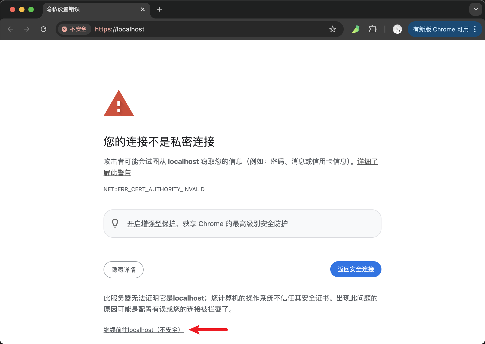
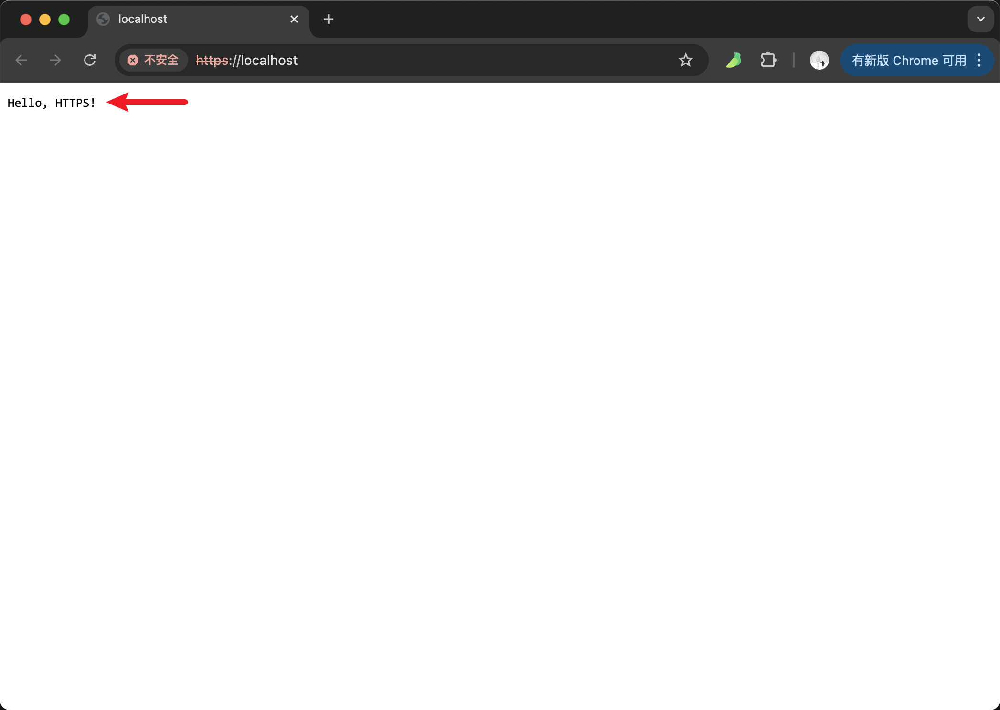

# [0028. 基于 nodejs 在本地快速启动一个 https 服务](https://github.com/Tdahuyou/TNotes.nodejs/tree/main/notes/0028.%20%E5%9F%BA%E4%BA%8E%20nodejs%20%E5%9C%A8%E6%9C%AC%E5%9C%B0%E5%BF%AB%E9%80%9F%E5%90%AF%E5%8A%A8%E4%B8%80%E4%B8%AA%20https%20%E6%9C%8D%E5%8A%A1)

<!-- region:toc -->
- [1. 📒 运行 HTTPS 服务的前提条件 - 证书 ➕ 私钥](#1--运行-https-服务的前提条件---证书--私钥)
- [2. 📒 安装工具 - OpenSSL](#2--安装工具---openssl)
- [3. 💻 demos.1 - 实现方案：使用 Node.js 的 `https` 模块 + `express` 服务框架](#3--demos1---实现方案使用-nodejs-的-https-模块--express-服务框架)
<!-- endregion:toc -->

## 1. 📒 运行 HTTPS 服务的前提条件 - 证书 ➕ 私钥

- 要运行 HTTPS 服务，需要以下两样东西：
  - **SSL/TLS 证书**：用于加密通信。
  - **私钥**：与证书配对，用于身份验证。
- 我们可以使用以下两种方式获取证书和私钥：
  - 1️⃣ **自签名证书**（适合本地开发）：
     - 使用工具生成自签名证书（如 `openssl`）。
     - 这篇笔记主要介绍的是通过 openssl 来生成自签名证书的方式来创建 HTTPS 服务。
  - 2️⃣ **正式证书**（适合生产环境）：
     - 从受信任的证书颁发机构（CA）获取证书。

## 2. 📒 安装工具 - OpenSSL

- macOS: `brew install openssl`
- Windows: 下载并安装 [OpenSSL](https://slproweb.com/products/Win32OpenSSL.html)。
- Linux: `sudo apt-get install openssl`
- 验证 openssl 是否安装成功：
  ```bash
  openssl version
  ```
  - 
  - 如果在终端执行上述命令 `openssl version` 之后，打印出了版本信息，那么意味着你的电脑上已经安装好了 openssl，并且环境变量也已经配置好了，接下来就可以正常使用了。

## 3. 💻 demos.1 - 实现方案：使用 Node.js 的 `https` 模块 + `express` 服务框架

::: code-group

```bash [使用 openssl 生成自签名证书]
openssl req -x509 -newkey rsa:4096 -keyout key.pem -out cert.pem -days 365 -nodes
# 相关参数的含义：
# -x509：生成自签名证书。
# -newkey rsa:4096：生成 4096 位的 RSA 私钥。
# -keyout key.pem：输出私钥文件为 key.pem。
# -out cert.pem：输出证书文件为 cert.pem。
# -days 365：证书有效期为 365 天。
# -nodes：不加密私钥。

# 执行后会在当前位置生成两个文件：
# key.pem：私钥文件。
# cert.pem：证书文件。
# 这俩文件在后续使用 nodejs 内置的 https 模块创建 HTTPS 服务的时候需要用到。
```

```js [server.js]
const https = require('https')
const fs = require('fs')
const path = require('path')

// 加载 SSL/TLS 证书和私钥
const options = {
  key: fs.readFileSync(path.join(__dirname, 'key.pem')), // 私钥文件路径
  cert: fs.readFileSync(path.join(__dirname, 'cert.pem')), // 证书文件路径
}

// 创建 HTTPS 服务
https
  .createServer(options, (req, res) => {
    res.writeHead(200, { 'Content-Type': 'text/plain' })
    res.end('Hello, HTTPS!\n')
  })
  .listen(443, () => {
    console.log('HTTPS Server running at https://localhost:443/')
  })

// 以上是一个基于 Node.js 的简单 HTTPS 服务示例。
```

```bash [启动服务]
node server.js
```

:::

- 最终效果：

::: swiper



:::

> 会发现 Chrome 浏览器会提示这个链接是不安全的，有些业务可能必须要求得是 HTTPS 服务，并且要求浏览器不能有安全警告（否则某些浏览器提供的 API 的使用可能会受限）。

::: details 【 🔍 关于如何让浏览器相信本地 HTTPS 服务是安全的说明】
- [allow-insecure-localhost has been removed as of Chrome 119](https://support.google.com/chrome/thread/241869686/allow-insecure-localhost-has-been-removed-as-of-chrome-119?hl=en)
- 这是 chrome 社区中的一篇文章，提到了在 chrome 119 版本之后，不允许使用自签名证书。有很多开发者吐槽这一配置的移除对他们开发造成的影响很大。
- 解决方案：
  - 手动降低 chrome 的版本，开启 `chrome://flags/#allow-insecure-localhost` 配置。
  - 改用 Firefox 貌似也可以。
  - 也可以尝试修改证书配置，让计算机相信上述自建的证书是安全的。
:::

- 在生成证书的时候，会提示填写相关参数：
  - 在生成自签名证书时，`openssl` 会提示你输入一些关于证书的信息。
  - 这些信息将被包含在证书的“Distinguished Name”（DN）中。
  - 懒得输的话，你可以将参数都设置为空（即直接按回车键），使用默认值。
    - 在生产环境中，需要严格按照规范来输，否则可能会导致某些问题或不便。比如，由于一些字段不规范，导致浏览器不认你的证书。
  - 
  - 1️⃣ Country Name (2 letter code)
    - **描述**：国家代码，通常是两个字母的 ISO 3166-1 alpha-2 标准。
    - **示例**：`US`（美国）、`CN`（中国）、`AU`（澳大利亚）。
    - 如果是本地开发环境，可以留空或填入任意值（如 `XX`）。
    - 如果用于生产环境，应填写正确的国家代码。
  - 2️⃣ State or Province Name (full name)
    - **描述**：州或省的全名。
    - **示例**：`California`、`New York`、`Beijing`。
    - 可以留空或填入任意值（如 `Some-State`）。
    - 生产环境建议填写真实信息。
  - 3️⃣ Locality Name (eg, city)
    - **描述**：城市名称。
    - **示例**：`San Francisco`、`New York City`、`Beijing`。
    - 可以留空或填入任意值（如 `Some-City`）。
    - 生产环境建议填写真实信息。
  - 4️⃣ Organization Name (eg, company)
    - **描述**：组织或公司的名称。
    - **示例**：`Internet Widgets Pty Ltd`、`Acme Corporation`。
    - 可以留空或填入任意值（如 `My Company`）。
    - 生产环境建议填写真实信息。
  - 5️⃣ Organizational Unit Name (eg, section)
    - **描述**：组织单位的名称，通常指部门或小组。
    - **示例**：`Engineering`、`Sales`。
    - 可以留空或填入任意值（如 `My Department`）。
    - 生产环境建议填写真实信息。
  - 6️⃣ Common Name (e.g. server FQDN or YOUR name)
    - **描述**：通用名称，通常是服务器的完全限定域名（FQDN）或个人姓名。
    - **示例**：`localhost`、`example.com`、`John Doe`。
    - 对于 HTTPS 服务，`Common Name` 必须与访问该服务的域名匹配，否则浏览器会显示证书不匹配的警告。
    - 如果是本地开发环境，可以使用 `localhost` 或其他测试域名。
    - 如果用于生产环境，必须填写真实的域名。
  - 7️⃣ Email Address
    - **描述**：联系邮箱地址。
    - **示例**：`admin@example.com`。
    - 可以留空或填入任意值（如 `myemail@example.com`）。
    - 生产环境建议填写真实的联系邮箱。
