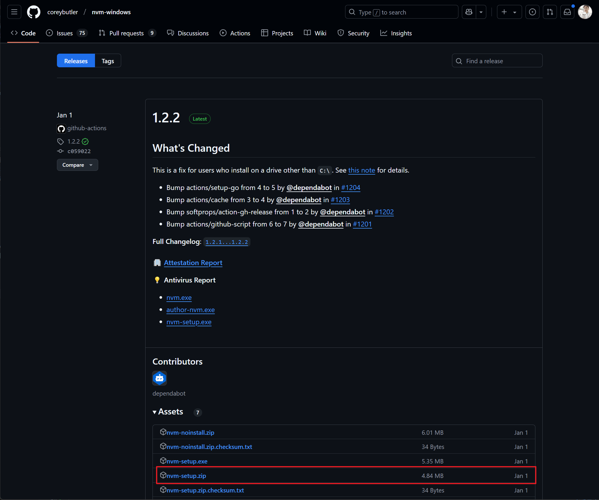
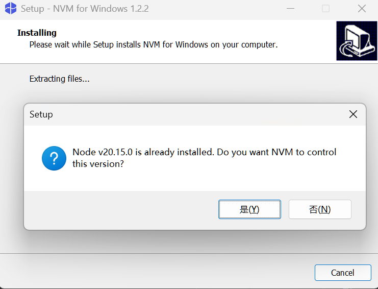
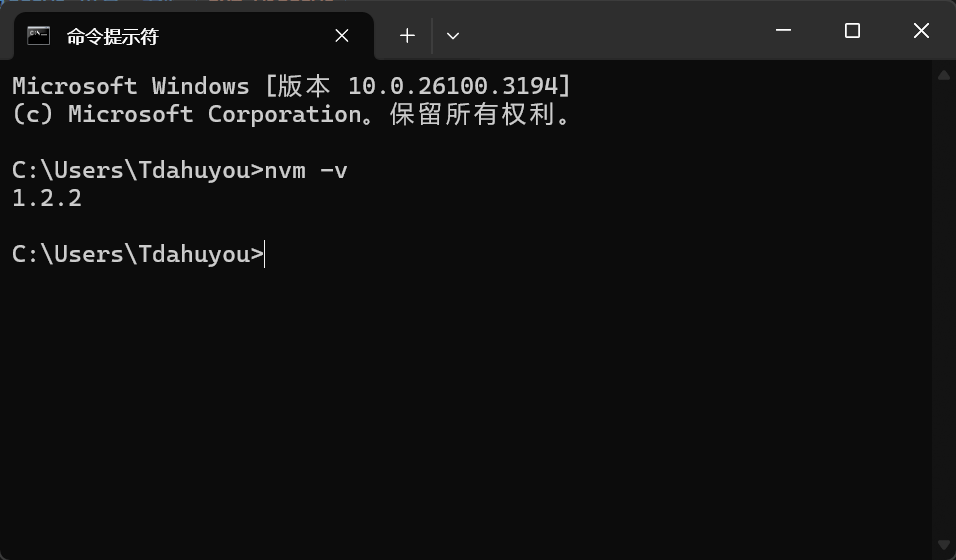

# [0029. nvm](https://github.com/Tdahuyou/TNotes.nodejs/tree/main/notes/0029.%20nvm)

<!-- region:toc -->
- [1. 📒 概述](#1--概述)
- [2. 🔗 nvm-windows - Github 仓库](#2--nvm-windows---github-仓库)
- [3. 🔗 nvm-sh - Github 仓库](#3--nvm-sh---github-仓库)
- [4. 📒 什么是 NVM？](#4--什么是-nvm)
- [5. 💻 下载和安装 NVM](#5--下载和安装-nvm)
  - [5.1. Windows 用户：安装 `nvm-windows`](#51-windows-用户安装-nvm-windows)
  - [5.2. macOS/Linux 用户：安装 nvm-sh](#52-macoslinux-用户安装-nvm-sh)
- [6. 💻 使用 NVM 管理 Node.js 版本](#6--使用-nvm-管理-nodejs-版本)
<!-- endregion:toc -->

## 1. 📒 概述

- 本文简单介绍了 NVM 是什么？如何安装 NVM，以及 NVM 的一些常见的基础命令。
- 通过 NVM，你可以轻松管理多个 Node.js 版本，避免因 Node.js 版本和你的项目不兼容导致的问题。以下是常用的命令总结：

| 命令                          | 功能                          |
| ----------------------------- | ----------------------------- |
| `nvm install <version>`       | 安装指定版本的 Node.js        |
| `nvm use <version>`           | 切换到指定版本的 Node.js      |
| `nvm uninstall <version>`     | 卸载指定版本的 Node.js        |
| `nvm list`                    | 查看已安装的 Node.js 版本     |
| `nvm list available`          | 查看所有可安装的 Node.js 版本 |
| `nvm alias default <version>` | 设置默认使用的 Node.js 版本   |

## 2. 🔗 nvm-windows - Github 仓库

- https://github.com/coreybutler/nvm-windows
- https://github.com/coreybutler/nvm-windows/releases
  - nvm-windows 的 GitHub 发布页面
  - 在这里可以下载最新版的 `nvm-setup.zip` 文件，可以用这玩意儿在你的 Windows 设备上安装 NVM。

## 3. 🔗 nvm-sh - Github 仓库

- https://github.com/nvm-sh/nvm
  - 在 macOS 和 Linux 系统中，可以使用 nvm-sh 来完成 nvm 的安装。

## 4. 📒 什么是 NVM？

- NVM（Node Version Manager）是一个用于管理 Node.js 版本的工具。
- 它允许你在同一台机器上安装和切换多个 Node.js 版本，而不会相互冲突。
  - 这对于开发环境尤其有用，因为不同的项目可能需要不同版本的 Node.js。

## 5. 💻 下载和安装 NVM

- 根据操作系统选择合适的 NVM 工具，NVM 有两种主要实现：
  - `nvm-windows`：适用于 Windows 系统。
  - `nvm-sh/nvm`：适用于 macOS 和 Linux 系统。
- 以下是针对不同操作系统的安装步骤：

### 5.1. Windows 用户：安装 `nvm-windows`

- **下载安装包**
  - 前往 [nvm-windows 的 GitHub 发布页面](https://github.com/coreybutler/nvm-windows/releases)。
  - 下载最新版本的 `nvm-setup.zip` 文件。
- **解压并运行安装程序**
  - 解压下载的压缩包。
  - 运行 `nvm-setup.exe` 安装程序，按照提示完成安装。
  - 如果你本地已经安装了 nodejs，则在安装的最后一步会弹出一个 dialog 让你选择是否需要使用 nvm 来管理这个 nodejs 版本。直接点击 yes 即可。
- **验证安装**

```bash
# 打开命令提示符（CMD）或 PowerShell，运行以下命令以验证安装是否成功：
nvm version
# 如果显示版本号（如 1.2.2），说明安装成功。
```

::: swiper



:::

### 5.2. macOS/Linux 用户：安装 nvm-sh

::: code-group

```bash [安装]
# 打开终端，运行以下命令：
curl -o- https://raw.githubusercontent.com/nvm-sh/nvm/v0.40.1/install.sh | bash

# 或者使用 wget：
wget -qO- https://raw.githubusercontent.com/nvm-sh/nvm/v0.40.1/install.sh | bash

# 注意：v0.40.1 是当前（2025年3月7日09:45:41）最新的稳定版本，请确保使用最新版本。
# 具体版本根据你安装时的版本来定。
# 你可以在 https://github.com/nvm-sh/nvm 查看 nvm-sh 的 releases。
```

```bash [处理环境变量]
# 配置环境变量
# 安装完成后，NVM 会将自身添加到你的 shell 配置文件中（如 .bashrc、.zshrc 或 .bash_profile）。
# 你可以重新打开一个 terminal 输入 nvm -v 看看是否已经生效。


# 如果未自动添加，可以手动编辑配置文件，添加以下内容：
export NVM_DIR="$([ -z "${XDG_CONFIG_HOME-}" ] && printf %s "${HOME}/.nvm" || printf %s "${XDG_CONFIG_HOME}/nvm")"
[ -s "$NVM_DIR/nvm.sh" ] && \. "$NVM_DIR/nvm.sh"


# 重新加载配置文件 - 运行以下命令以应用更改：
source ~/.bashrc
# 或者根据你的 shell 类型运行相应的命令（如 source ~/.zshrc）。
```

```bash [验证安装]
# 验证安装 - 运行以下命令检查是否安装成功：
nvm --version
# 如果显示版本号（如 0.40.1），说明安装成功。
```

:::

## 6. 💻 使用 NVM 管理 Node.js 版本

::: code-group

```bash [list]
# 查看可用的 Node.js 版本
# 运行以下命令查看所有可安装的 Node.js 版本：
nvm list available
# 这会列出 LTS（长期支持）版本和最新的发布版本。
# 实际上是列不全的，因为 nodejs 版本太多了，它只会列出近期的一些版本。
# 你可以通过这个链接查看所有 Node.js 版本：https://nodejs.org/en/download/releases

# 下面是在 2025年3月7日10:08:40 时执行 nvm list available 得到的结果：
# |   CURRENT    |     LTS      |  OLD STABLE  | OLD UNSTABLE |
# |--------------|--------------|--------------|--------------|
# |    23.9.0    |   22.14.0    |   0.12.18    |   0.11.16    |
# |    23.8.0    |   22.13.1    |   0.12.17    |   0.11.15    |
# |    23.7.0    |   22.13.0    |   0.12.16    |   0.11.14    |
# |    23.6.1    |   22.12.0    |   0.12.15    |   0.11.13    |
# |    23.6.0    |   22.11.0    |   0.12.14    |   0.11.12    |
# |    23.5.0    |   20.18.3    |   0.12.13    |   0.11.11    |
# |    23.4.0    |   20.18.2    |   0.12.12    |   0.11.10    |
# |    23.3.0    |   20.18.1    |   0.12.11    |    0.11.9    |
# |    23.2.0    |   20.18.0    |   0.12.10    |    0.11.8    |
# |    23.1.0    |   20.17.0    |    0.12.9    |    0.11.7    |
# |    23.0.0    |   20.16.0    |    0.12.8    |    0.11.6    |
# |   22.10.0    |   20.15.1    |    0.12.7    |    0.11.5    |
# |    22.9.0    |   20.15.0    |    0.12.6    |    0.11.4    |
# |    22.8.0    |   20.14.0    |    0.12.5    |    0.11.3    |
# |    22.7.0    |   20.13.1    |    0.12.4    |    0.11.2    |
# |    22.6.0    |   20.13.0    |    0.12.3    |    0.11.1    |
# |    22.5.1    |   20.12.2    |    0.12.2    |    0.11.0    |
# |    22.5.0    |   20.12.1    |    0.12.1    |    0.9.12    |
# |    22.4.1    |   20.12.0    |    0.12.0    |    0.9.11    |
# |    22.4.0    |   20.11.1    |   0.10.48    |    0.9.10    |

# This is a partial list. For a complete list, visit https://nodejs.org/en/download/releases


# 查看已安装的 Node.js 版本
# 运行以下命令查看本地已安装的所有 Node.js 版本：
nvm list
```

```bash [install]
# 安装指定版本的 Node.js
# 使用以下命令安装特定版本的 Node.js：
# nvm install <version>

# eg.
# 安装最新的 LTS 版本：
nvm install --lts

# eg.
# 安装指定版本（如 v16.20.0）：
nvm install 16.20.0
```

```bash [use]
# 切换 Node.js 版本
# 安装多个版本后，可以通过以下命令切换当前使用的 Node.js 版本：
# nvm use <version>

# eg.
nvm use 16.20.0
```

```bash [alias]
# 直接设置默认版本：
nvm alias default <version>

# eg.
nvm alias default 16.20.0
# 这样每次打开终端时都会自动使用该版本 16.20.0
```

```bash [uninstall]
# 卸载某个 Node.js 版本
# 如果不再需要某个版本，可以使用以下命令卸载：
# nvm uninstall <version>

# eg.
nvm uninstall 16.20.0
```

```bash [检查当前版本]
# 检查当前使用的 Node.js 版本（就是 node 查看版本的命令）
# 运行以下命令查看当前正在使用的 Node.js 版本：
node -v
```

:::
