# [0054. 错误优先的回调风格](https://github.com/tnotesjs/TNotes.nodejs/tree/main/notes/0054.%20%E9%94%99%E8%AF%AF%E4%BC%98%E5%85%88%E7%9A%84%E5%9B%9E%E8%B0%83%E9%A3%8E%E6%A0%BC)

<!-- region:toc -->

- [1. 📝 概述](#1--概述)
- [2. 📒 错误处理](#2--错误处理)
- [3. 💻 demos.1 - 读取文件的错误优先回调风格](#3--demos1---读取文件的错误优先回调风格)
- [4. 💻 demos.2 - 自定义错误优先回调风格函数](#4--demos2---自定义错误优先回调风格函数)
- [5. 💻 demos.3 - `util.promisify(original)` - 转换异步函数的风格](#5--demos3---utilpromisifyoriginal---转换异步函数的风格)

<!-- endregion:toc -->

## 1. 📝 概述

- **Error-First Callback Style**
  - **错误优先回调风格（Error-First Callback Style）** 是 Node.js 中一种常见的异步编程模式，用于处理异步操作的结果或错误。
  - 在这种风格中，回调函数的第一个参数始终是错误对象（`err`），后续的参数才是操作的结果数据。
- **核心特点**：回调函数的第一个参数是错误对象，后续参数是操作结果。
  1. **第一个参数为错误对象**：
     - 如果操作成功，错误对象为 `null` 或 `undefined`。
     - 如果操作失败，错误对象包含具体的错误信息。
  2. **后续参数为结果数据**：
     - 如果操作成功，结果数据会作为回调函数的第二个参数（或更多参数）传递。
- **约定俗成的规则**：
  - **错误优先回调风格** 是一种约定俗成的异步编程模式，适用于 Node.js 环境。
    - 这种风格在 Node.js 的核心模块（如 `fs`、`http` 等）和许多第三方库中广泛使用，因此它成为了事实上的标准，开发者需要遵循这种约定来编写兼容的代码。
  - **统一的错误处理机制**：
    - 所有异步操作都遵循相同的模式，便于开发者理解和维护代码。
  - **避免遗漏错误处理**：
    - 将错误作为第一个参数强制开发者显式处理错误，减少了忽略错误的可能性。
- **转换**：
  - 如果你需要将这种风格的函数转换为现代的 `Promise` 风格，可以使用 `util.promisify` 工具函数。
  - 如果你需要将 **Promise** 风格的函数转换为 **错误优先回调风格**，可以使用 `util.callbackify` 工具函数。

```mermaid
flowchart LR
    A[错误优先回调风格函数] -->|util.promisify| B[Promise 风格函数]
    B -->|util.callbackify| A
```



## 2. 📒 错误处理

- 回调函数第一个参数为 `error`
- 异步方法：通过回调函数的第一个参数捕获错误；
- 同步方法：需使用 `try-catch` 语句捕获异常；

## 3. 💻 demos.1 - 读取文件的错误优先回调风格

::: code-group

```javascript [1.cjs]
const fs = require('fs')
const path = require('path')

const filePath = path.join(__dirname, '1.txt')

// 错误优先回调风格
fs.readFile(
  filePath,
  'utf8',
  (
    err, // 回调的第一个参数是错误对象
    data // 回调的后续参数才是结果数据
  ) => {
    if (err) {
      console.error('读取文件失败:', err)
      return
    }
    console.log('文件内容：', data)
  }
)

// 输出：
// 问价内容：test

// Node.js 的 fs.readFile 方法就是一个典型的错误优先回调风格的例子。

// 如果文件读取成功：
// err 为 null。
// data 包含文件内容。

// 如果文件读取失败：
// err 包含错误信息。
// data 不会被传递。
```

```txt [1.txt]
test
```

:::

## 4. 💻 demos.2 - 自定义错误优先回调风格函数

::: code-group

```javascript [1.cjs]
function divide(a, b, callback) {
  if (b === 0) {
    // 操作失败时，传递错误对象
    return callback(new Error('除数不能为 0'))
  }
  // 操作成功时，第一个参数为 null，第二个参数为结果
  callback(null, a / b)
}

divide(10, 2, (err, result) => {
  if (err) {
    console.error('发生错误:', err.message)
    return
  }
  console.log('结果:', result) // 输出: 结果: 5
})

divide(10, 0, (err, result) => {
  if (err) {
    console.error('发生错误:', err.message) // 输出: 发生错误: 除数不能为 0
    return
  }
  console.log('结果:', result)
})
```

:::

## 5. 💻 demos.3 - `util.promisify(original)` - 转换异步函数的风格

::: code-group

```javascript [1.cjs]
const util = require('util')

function divide(a, b, callback) {
  if (b === 0) {
    // 操作失败时，传递错误对象
    return callback(new Error('除数不能为 0'))
  }
  // 操作成功时，第一个参数为 null，第二个参数为结果
  callback(null, a / b)
}

divide(10, 2, (err, result) => {
  if (err) {
    console.error('发生错误:', err.message)
    return
  }
  console.log('结果:', result) // 输出: 结果: 5
})

divide(10, 0, (err, result) => {
  if (err) {
    console.error('发生错误:', err.message) // 输出: 发生错误: 除数不能为 0
    return
  }
  console.log('结果:', result)
})

// 传入一个遵循常见的 错误优先回调风格 的函数，然后返回一个返回值为 Promise 的函数。
const dividePromise = util.promisify(divide)

dividePromise(10, 2)
  .then((result) => {
    console.log(result) // 输出：5
  })
  .catch((error) => {
    console.error(error)
  })

dividePromise(10, 0)
  .then((result) => {
    console.log(result)
  })
  .catch((error) => {
    console.error(error) // 输出：Error: 除数不能为 0
  })

const divideErrorFirstCallback = util.callbackify(dividePromise)

divideErrorFirstCallback(10, 2, (err, result) => {
  if (err) {
    console.error('发生错误:', err.message)
    return
  }
  console.log('结果:', result) // 输出: 结果: 5
})

divideErrorFirstCallback(10, 0, (err, result) => {
  if (err) {
    console.error('发生错误:', err.message) // 输出: 发生错误: 除数不能为 0
    return
  }
  console.log('结果:', result)
})
```

:::
