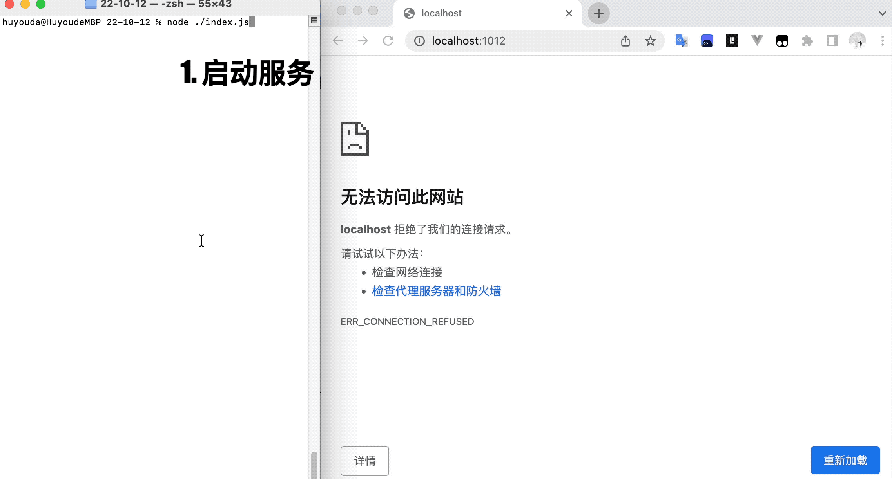

# [0080. http 模块概述](https://github.com/Tdahuyou/TNotes.nodejs/tree/main/notes/0080.%20http%20%E6%A8%A1%E5%9D%97%E6%A6%82%E8%BF%B0)

<!-- region:toc -->

- [1. 📒 概述](#1--概述)
- [2. 💻 demos.1 - 基于 http 模块实现的一个简单的静态资源服务](#2--demos1---基于-http-模块实现的一个简单的静态资源服务)
- [3. 🔗 References](#3--references)

<!-- endregion:toc -->

## 1. 📒 概述

- 本篇文档的主要内容：介绍如何使用 Node.js 的 http 模块来搭建一个本地的静态资源服务器。
- **目录结构**：

```bash
.
├── 1.cjs
└── resources # 存放资源文件
    ├── avatar.png
    ├── css
    │   └── index.css
    ├── index.html
    └── test
        └── index.html
```

- **测试地址**：
  - 访问首页
    - http://localhost:1012
    - http://localhost:1012/
  - 访问 test 目录：http://localhost:1012/test
  - 访问样式资源：http://localhost:1012/css/index.css
  - 访问图片资源：http://localhost:1012/avatar.png
- **查看最终效果**：
  - 
  - 注：这是早期写的笔记，当时的源码资源懒得找了，就按照相同的资源目录结构，简单还原了大致的场景。其中有些图片和内容是对不上的，而这些并非重点，不要 care 就好。

## 2. 💻 demos.1 - 基于 http 模块实现的一个简单的静态资源服务

::: code-group

<<< ./demos/1/1.cjs {js}

:::

## 3. 🔗 References

::: details

- https://nodejs.org/api/http.html#httpcreateserveroptions-requestlistener
  - Node.js - `http.createServer([options][, requestListener])`

:::
