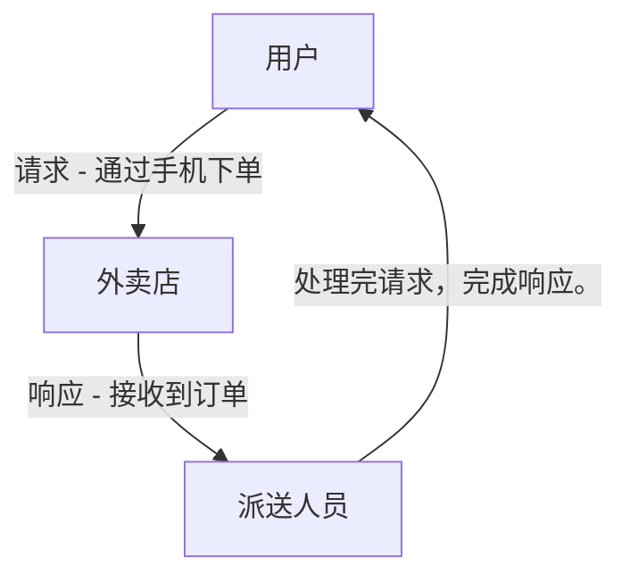

# [0084. 理解“请求”和“响应”](https://github.com/Tdahuyou/TNotes.nodejs/tree/main/notes/0084.%20%E7%90%86%E8%A7%A3%E2%80%9C%E8%AF%B7%E6%B1%82%E2%80%9D%E5%92%8C%E2%80%9C%E5%93%8D%E5%BA%94%E2%80%9D)

<!-- region:toc -->

- [1. 📝 概述](#1--概述)
- [2. 💻 示例 - 外卖点餐](#2--示例---外卖点餐)
- [3. 📒 请求（Request）](#3--请求request)
- [4. 📒 响应（Response）](#4--响应response)

<!-- endregion:toc -->

## 1. 📝 概述

- 在计算机网络通信中，“请求”和“响应”是一对常见的概念，通常用于描述客户端与服务器之间的交互过程。
- **请求（Request）**：
  - 客户端向服务器发起的操作指令，希望服务器完成某个任务并返回结果。
  - 例如，用户在浏览器中输入网址并按下回车键，这就是向服务器发送了一个请求。
- **响应（Response）**：
  - 服务器接收到请求后，根据请求内容进行处理，并将处理结果返回给客户端。
  - 例如，服务器接收到用户的请求后，返回网页内容或数据给浏览器。

## 2. 💻 示例 - 外卖点餐

- **请求**：用户通过手机下单，相当于客户端向服务器发送了一个请求。
- **响应**：外卖店接收到订单后，制作好外卖并通过派送人员送达用户手中，相当于服务器处理完请求后返回了响应。
- 这种“请求-响应”的模式是现代网络通信的核心机制，无论是外卖点餐还是 Web 应用开发，都遵循这一基本流程。

## 3. 📒 请求（Request）

- **定义**：“请求”是指客户端向服务器发出的一种指令或请求，希望服务器执行某个操作并返回结果。
- **类比**：在图中的外卖点餐场景中，“请求”可以类比为用户通过手机下单的行为。用户通过手机向外卖店发送了一个订单信息，这个订单就是一种“请求”，告诉外卖店需要什么菜品、送到哪里等。
- **Web 开发中的请求**：在 Web 应用中，当用户在浏览器地址栏输入一个网址（例如 `https://www.taobao.com/`），按下回车键时，浏览器会向对应的服务器发送一个 HTTP 请求。这个请求包含了用户想要访问的内容（如首页内容）、请求的方式（如 GET 或 POST）以及其他相关信息（如请求头、参数等）。

## 4. 📒 响应（Response）

- **定义**：“响应”是指服务器接收到客户端的请求后，根据请求的内容进行处理，并将处理结果返回给客户端的过程。
- **类比**：在图中的外卖点餐场景中，“响应”可以类比为外卖店接到订单后，制作好外卖，并通过派送人员将外卖送到用户手中的过程。外卖店的“响应”是对外卖订单的处理结果，即用户所点的外卖。
- **Web 开发中的响应**：在 Web 应用中，当服务器接收到浏览器的请求后，它会根据请求的内容进行相应的处理（如查询数据库、生成页面等），然后将处理结果（如网页内容、JSON 数据等）封装成 HTTP 响应返回给浏览器。浏览器接收到响应后，会解析并显示给用户。
