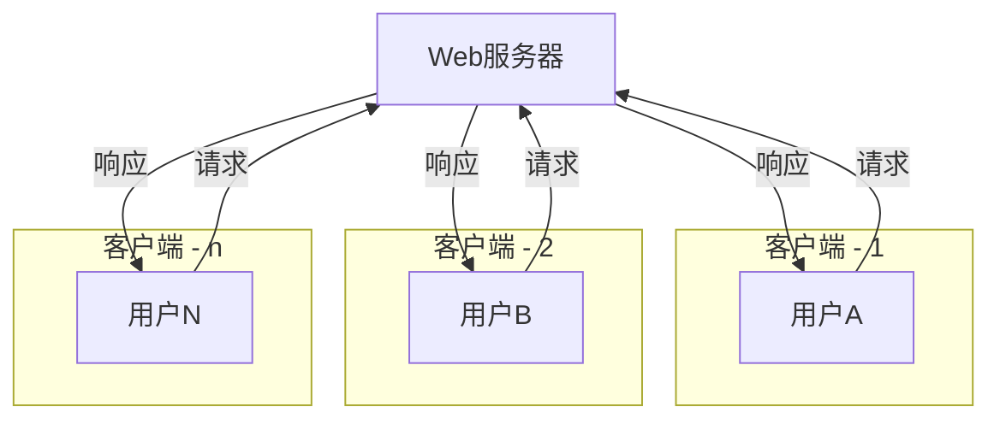

# [0085. 理解“客户端”和“服务端”](https://github.com/Tdahuyou/TNotes.nodejs/tree/main/notes/0085.%20%E7%90%86%E8%A7%A3%E2%80%9C%E5%AE%A2%E6%88%B7%E7%AB%AF%E2%80%9D%E5%92%8C%E2%80%9C%E6%9C%8D%E5%8A%A1%E7%AB%AF%E2%80%9D)

<!-- region:toc -->

- [1. 📝 概述](#1--概述)
- [2. 💻 示例 - 外卖点餐](#2--示例---外卖点餐)
- [3. 📒 客户端（Client）](#3--客户端client)
- [4. 📒 服务端（Server）](#4--服务端server)

<!-- endregion:toc -->

## 1. 📝 概述

- 在计算机网络通信中，“客户端”和“服务端”是两个核心概念，它们描述了网络交互的两端角色及其功能。结合图片中的外卖点餐场景以及 Web 应用开发的类比，我们可以更直观地理解这两个概念。
- **客户端（Client）**：是发起请求的一方，通常是一个用户或设备，负责提出需求并接收服务端返回的结果。例如，在 Web 应用中，浏览器就是客户端。
- **服务端（Server）**：是接收并处理客户端请求的一方，通常是一个运行在服务器上的程序或系统，负责根据客户端的请求进行处理并返回响应。例如，在 Web 应用中，淘宝的服务器就是服务端。

## 2. 💻 示例 - 外卖点餐

- **客户端**：下方的用户，代表发起请求的一方，类似于点外卖的用户。
- **服务端**：上方的服务器，代表接收并处理请求的一方，类似于外卖店。
- **请求**：客户端向服务端发送的操作指令，例如用户下单。
- **响应**：服务端处理完请求后返回的结果，例如外卖店制作好外卖并送达用户手中。
- 这种“客户端-服务端”的模式是现代网络通信的核心架构，无论是外卖点餐还是 Web 应用开发，都遵循这一基本模式。

## 3. 📒 客户端（Client）

- **定义**：“客户端”是指发起请求的一方，通常是一个用户或设备，它向服务器端发送请求，并等待服务器端的响应。客户端的主要任务是提出需求并接收服务端返回的结果。
- **类比**：在图中的外卖点餐场景中，“客户端”可以类比为点外卖的用户。用户通过手机下单，告诉外卖店需要什么菜品、送到哪里等信息，这个过程就是客户端的行为。
- **Web 开发中的客户端**：在 Web 应用中，浏览器就是典型的客户端。当用户在浏览器中输入一个网址（例如 `https://www.taobao.com/`），按下回车键时，浏览器作为客户端会向对应的服务器发送一个 HTTP 请求。浏览器的作用是：
  - **发起请求**：将用户的操作（如访问网页、提交表单等）转化为请求发送给服务器。
  - **接收响应**：从服务器接收返回的内容（如网页内容、JSON 数据等），并将其展示给用户。

## 4. 📒 服务端（Server）

- **定义**：“服务端”是指接收并处理客户端请求的一方，通常是一个运行在服务器上的程序或系统。服务端的主要任务是根据客户端的请求进行处理，并将处理结果返回给客户端。
- **类比**：在图中的外卖点餐场景中，“服务端”可以类比为外卖店。外卖店接收到用户的订单后，会制作好外卖，并通过派送人员将外卖送到用户手中，这个过程就是服务端的行为。
- **Web 开发中的服务端**：在 Web 应用中，服务器端通常是由一台或多台服务器组成的系统，负责处理客户端的请求并返回响应。例如，淘宝的服务器就是服务端。当用户访问淘宝网站时：
  - **接收请求**：服务器接收到浏览器发送的请求（如请求首页内容）。
  - **处理请求**：服务器根据请求的内容进行处理，可能包括查询数据库、生成页面等内容。
  - **返回响应**：服务器将处理结果（如网页内容、JSON 数据等）封装成 HTTP 响应返回给浏览器。
